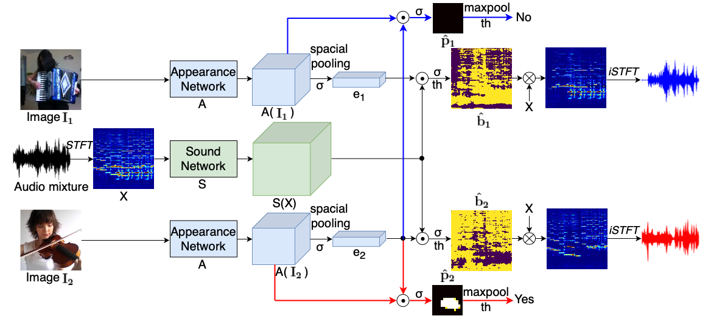

# Leveraging-Category-Information-for-Single-Frame-Visual-Sound-Source-Separation

[Paper](https://arxiv.org/pdf/2007.07984.pdf) | [project](https://ly-zhu.github.io/leveraging-category-information-for-single-frame-visual-sound-source-separation)

A PyTorch implementation of "Leveraging Category Information for Single-Frame Visual Sound Source Separation". Authors: [Lingyu Zhu](https://ly-zhu.github.io) and [Esa Rahtu](http://esa.rahtu.fi). Tampere University, Finland.



<!-- ## Examples of Sound Source Separation


## Examples of Sound Source Localization

-->

# Environment
	Python>=3.5, PyTorch>=0.4.0

# Preparing the data
	#Not released yet, but you can train the model on your own dataset for now by setting the following info:
	-Create a folder data/, place the csv file lists under the folder data/, the csv file has the format as below: 
		audio_path, frames_path, frames count
	-Edit the dataset path at line 163 of file dataset/music.py
		

# Model selection
Replace the --arch_frame and --arch_sound in scripts/train_locSep.sh and scripts/eval_locSep.sh to switch to diffeent appearance and sound networks.

# Training
	# Training the A(Res-50) + S(MV2) model
	./scripts/train_locSep.sh

	# Training the A(Res-50, att) + S(MV2) model
	-The network A(Res-50, att) + S(MV2) is trained based on A(Res-50) + S(MV2). 
	-Uncomment the line of "CUDA_VISIBLE_DEVICES="0" python -u main_Appearance_att_Sound.py $OPTS" in scripts/train_locSep.sh to start the training.

	# Training the A(CatEmb) + S(MV2) model
	-Uncomment the line of "CUDA_VISIBLE_DEVICES="0" python -u main_GCEmb_Sound.py $OPTS" in scripts/train_locSep.sh to start the training.


# Evaluation
	# Ajust accordingly based on the selected model
	./scripts/eval_locSep.sh


# Reference

[1] Zhu, Lingyu, and Esa Rahtu. "Visually guided sound source separation using cascaded opponent filter network." Proceedings of the Asian Conference on Computer Vision (ACCV). 2020.

[2] Zhao, Hang, et al. "The sound of pixels." Proceedings of the European conference on computer vision (ECCV). 2018.

[3] Arandjelovic, Relja, and Andrew Zisserman. "Objects that sound." Proceedings of the European Conference on Computer Vision (ECCV). 2018.

## Citation
```bibtex   
@inproceedings{zhu2021leveraging,
  title={Leveraging Category Information for Single-Frame Visual Sound Source Separation},
  author={Zhu, Lingyu and Rahtu, Esa},
  booktitle={2021 9th European Workshop on Visual Information Processing (EUVIP)},
  pages={1--6},
  year={2021},
  organization={IEEE}
}
```

# Acknowledgement
This repo is developed based on [Sound-of-Pixels](https://github.com/hangzhaomit/Sound-of-Pixels).
